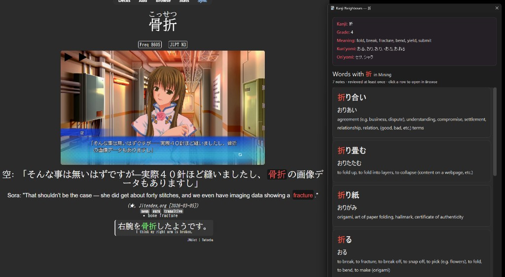

# Kanji Neighbours

Anki add-on for Japanese vocab study. During review, click a kanji in the header word to open a readable popup of other words in your deck that use the same character and have been reviewed at least once.

Each result can show:

- word + reading
- definition
- Japanese sentence
- native-language sentence

Click a row to open that note in Browse. The popup also loads a short kanji summary (meanings / readings) plus a right-side structure box with the dictionary radical, visual parts, and their meanings when you are online. Kanji facts come from [kanjiapi.dev](https://kanjiapi.dev); radical and component data comes from [KanjiVG](https://kanjivg.tagaini.net/).



## Requirements

- Anki 2.1.50+ (desktop)
- Your card template must mark the clickable word (see below)
- Field names are configured in the add-on settings (defaults match common mining layouts)

## Card template change

The add-on only makes kanji clickable inside elements matching its CSS selectors (default: `#word`, `.kanji-neighbours-word`).

If your template already has the word in `#word`, you may not need to change anything.

Otherwise wrap the word field, for example:

```html
<span class="kanji-neighbours-word">{{wordDictionaryForm}}</span>
```

Use whatever your word field is actually called (`Expression`, `Word`, etc.).

Without a matching selector on the card, clicks will do nothing.

## Install

1. Download / clone this repo
2. Copy the folder contents into:

   `%APPDATA%\Anki2\addons21\kanji_neighbours`

   On Windows, the folder must be named `kanji_neighbours` and contain `__init__.py` at the top level (not nested another folder deep).

3. Restart Anki
4. Confirm it appears under **Tools → Add-ons**

Example copy command:

```powershell
$src = "C:\path\to\kanji-neighbours"
$dst = "$env:APPDATA\Anki2\addons21\kanji_neighbours"
New-Item -ItemType Directory -Path $dst -Force | Out-Null
Copy-Item "$src\*" $dst -Recurse -Force
```

## Setup

1. **Tools → Add-ons → Kanji Neighbours → Config**
2. **Fields** tab: set Word / Reading / Definition / Japanese sentence / Native sentence to match your note type
3. **General** tab: choose search scope, minimum reviews, click selectors, and which rows appear in the popup
4. **Note types** tab (optional): overrides if you use more than one note type with different field names

## Usage

1. Review a card
2. Click a single kanji in the header word
3. Browse the popup list; click a row to open that note in Browse

## Behaviour notes

- Search is limited to the configured word field(s), not the whole card text by default
- Scope defaults to the deck of the card you are reviewing
- Only cards with enough reviews are included (`min_reps`, default 1)
- Definition HTML is stripped to plain text (line breaks / list items preserved where possible)
- Compatible with hover tools that wrap kanji (does not rewrite the card DOM)
- The popup's structure box shows the generally accepted dictionary radical and the main visual components (from KanjiVG), with component meanings where kanjiapi.dev has them

## Data sources

- [kanjiapi.dev](https://kanjiapi.dev) provides kanji facts.
- [KanjiVG](https://kanjivg.tagaini.net/) provides the radical and component structure, under [CC BY-SA 3.0](https://creativecommons.org/licenses/by-sa/3.0/).

## Config reference

See [config.md](config.md).
